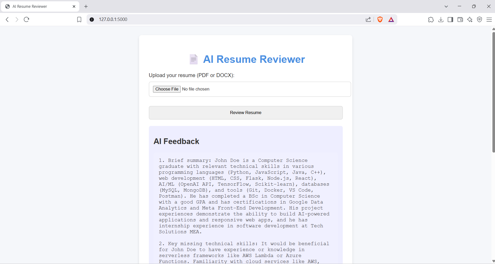

# 🤖 AI Resume Reviewer

A simple, clean, and functional web app that uses OpenRouter's GPT-style models to review resumes and provide structured feedback using natural language.



---

## 🔍 Features

- Upload `.pdf` or `.docx` resume files  
- AI-generated feedback based on resume content  
- Suggestions for improvement  
- Readiness score out of 100  
- Simple, responsive UI using HTML & CSS  
- Powered by OpenRouter + Mistral 7B

---

## 🛠️ Technologies Used

- Python
- Flask
- OpenRouter API (compatible with OpenAI SDK)
- HTML/CSS (with basic styling)
- PyMuPDF (for PDFs)
- python-docx (for DOCX files)

---

## 🚀 How to Run

### 1. Clone the repository
```bash
git clone https://github.com/your-username/ai-resume-reviewer.git
cd ai-resume-reviewer
